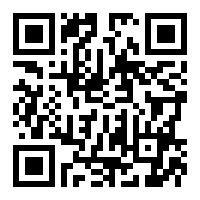

# YouTube Home Screen Shortcut

A web application that creates a custom home screen tile for iOS devices that redirects users to YouTube. This project allows users to add a YouTube shortcut to their iOS home screen with a custom icon and appearance.

## Features

- **Custom Icon**: Uses a custom YouTube icon for the home screen tile
- **iOS Optimized**: Specifically designed for iOS devices with proper meta tags
- **Responsive Design**: Optimized for mobile viewing
- **Easy Installation**: Simple QR code scanning or direct link access
- **Smart Redirection**: Automatically redirects to YouTube after being added to home screen

## How It Works

1. **Pin to Start**: Users access the app via QR code or direct link
2. **Add to Home Screen**: iOS users tap the share icon and select "Add to Home Screen"
3. **Custom Tile**: A custom YouTube tile is added to the home screen
4. **Redirect**: When tapped, the tile redirects users directly to YouTube.com

## Installation

### Method 1: QR Code
Scan the following QR Code and pin to start:

### Method 2: Direct Link
Visit: [http://binghuan.github.io/youtube/pin2start.html](http://binghuan.github.io/youtube/pin2start.html)

## Usage Instructions

1. Open the link on your iOS device
2. Tap the share button (📤) in Safari
3. Select "Add to Home Screen"
4. Customize the name if desired
5. Tap "Add" to create the shortcut
6. The YouTube tile will appear on your home screen

## Technical Details

### Files Structure
- `index.html` - Main application page with tile preview and instructions
- `pin2start.html` - Entry point that sets session storage and redirects to index
- `main.js` - JavaScript logic for handling redirection and pin state
- `icons/` - Various icon sizes for different device resolutions
- `images/` - UI instruction images (share and add to home screen icons)

### Key Features
- **Session Storage**: Uses `sessionStorage.PIN_TILE_STAY` to manage app state
- **Multiple Icon Sizes**: Includes icons from 16x16 to 1024x1024 for different devices
- **Mobile Web App Capable**: Configured to run as a web app when added to home screen
- **Apple Touch Icons**: Properly configured for iOS home screen integration

## Browser Compatibility

- **Primary**: iOS Safari (recommended)
- **Secondary**: Other mobile browsers with "Add to Home Screen" functionality

## Development

The app is built with vanilla HTML, CSS, and JavaScript. No build process or dependencies required.

### Local Development
1. Clone the repository
2. Open `index.html` in a web browser
3. For full functionality, test on an iOS device

## Deployment

This project is designed to be hosted on GitHub Pages at:
- Main URL: `http://binghuan.github.io/youtube/pin2start.html`
- Direct access: `http://binghuan.github.io/youtube/index.html`
